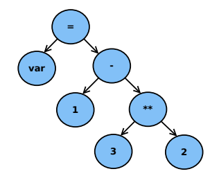

# Aula 20 - AWK e Flex

### AWK - Exemplos com Busca de Padrões
* Imprimir todas as linhas que começam com vogal
    * `awk '/^[AEIOUaeiou]/'`
* Imprimir linhas cuja segunda palavra é maior (numérica ou lexicograficamente) que a primeira
    * `awk '$2 > $1'`
    * A compração será numérica se ambas palavras forem representadas numericamente
* Resultados de jogos onde o primeiro time venceu (nome do time não pode ter espaços)
    * `awk '/^[a-zA-Z]+ +[0-9]+ +x +[0-9]+ +[a-zA-Z]+/ && $2 > $4'`
* Linhas começando com dígito ou com segundo campo maior que o terceiro
    * `awk '/^[0-9]/ || $2 > $3'`

### AWK - Operadores
* Operador **~** chama-se **match** e diz se uma expressão casa com o padrão determinado por uma regex
* Operadores **~** e **!~** podem ser usados dentro de comandos if, while e for
* **Exemplos**
    * Linhas cujo primeiro campo casa com a regex Janeiro
        * `awk '$1 ~ /Janeiro/'`
    * Soma dos tamnhos dos arquivos cujo mês de última alteração é Maio
        * `ls -lg | awk '$6 == "Mai" { sum += $5 } END { print sum }'`
        * Onde a saída do comando `ls -lg` é do tipo:
            * `-rw-r--r-- 1 staff   user   7652 Ago   10 14:07 01-introduction.md`

### AWK - Exemplo Completo
* Entrada em um arquivo coins.txt, coleção de moedas
* Formato do arquivo de entrada em 5 colunas
    * `metal | peso | ano de cunhagem | país de origem | nome`
* **Exemplo**
    * `gold      1    1986  USA    American Eagle`
* Listar todas moedas de ouro
    * `awk '/gold/' coins.txt`
    * `awk '/gold/ {print}' coins.txt`
    * `awk '/gold/ {print $0}' coins.txt`
* Listar nome das moedas de prata
    * `awk '/silver/ {print $5, $6, $7, $8}' coins.txt`
    * Algumas moedas possuem nomes compostos com até 4 palavras, por isso o comando imprime os campos de 5 a 8. Se uma linha não possui todos campos, o valor do campo faltante é uma string vazia
* Considerando valor do ouro por unidade de peso como U$ 425, calcula o valor total das moedas de ouro
    * `awk '/gold/ {weight += $2} END {print "value = $"425*weight}' coins.txt`
* Programa que resume tal coleção
    ```awk
    /gold/    { num_gold++; wt_gold += $2 }  # peso do ouro
    /silver/  { num_silver++; wt_silver += $2 }  # peso da prata
    END { val_gold = 485 * wt_gold;  # calcula valor do ouro
          val_silver = 16 * wt_silver;  # valor da prata
          total = val_gold + val_silver;
          printf("\n");
          printf("Quantidade de moedas de ouro: %2d\n", num_gold);
          printf("Peso das moedas de ouro: %5.2f\n", wt_gold);
          printf("Valor das moedas de ouro: %7.2f\n", val_gold);
          printf("\n");
          printf("Quantidade de moedas de prata: %2d\n", num_silver);
          printf("Peso das moedas de prata: %5.2f\n", wt_silver);
          printf("Valor das moedas de prata: %7.2f\n", val_silver);
          printf("\n");
          printf("Número total de moedas: %2d\n", NR);
          printf("Valor da coleção: %7.2f\n", total);
        }
    ```

### AWK - Outras Funcionalidades
* `/(<string1>|(<string2>)/`: padrões de busca alternativos
* `/(<string1>/,/(<string2>)/`: define faixa de linhas delimitadas por duas strings
* Operadores usadas na definição de condições de busca: `== != < > <= >=`
* Operadores de conexão de condições: `&& ||`
* Operadores aritméticos: `+ - * / % ++ --`
* Funções Aritméticas: `sqrt log exp int`
* Funções para Strings: `length substr split index`
* Estruturas de controle de fluxo: `while if for`

### AWK - Mais Exemplos
* [Seção de Exemplos do Manual de AWK](http://www.gnu.org/software/gawk/manual/gawk.html#Sample-Programs)

### Flex - Processo de Compilação
* Compilador ou interpretador de linguagem decomposto em duas subtarefas
    * Ler código fonte, descobrir sua estrutura
    * Processar a estrutura para gerar código executável
* A leitura do código fonte pode ser dividida em duas
    * Dividir o arquivo de entrada em tokens (itens léxico) -> **Análise Léxica**
    * Encontrar estrutura hierárquica do programa -> **Análise Sintática**
* **Processo de Compilação:**
    * Analisador Léxico (Scanner) -> Analisador Sintático (Parser) -> Analisador Semântico -> Otimizador -> Gerador de Código Executável
* **Análise Léxica**: `var1 = 1 - 3**2`
    * **Lexema: Tipo de Token**
        * `var`: Variável
        * `=`: Operador de atribuição
        * `1`: Número
        * `-`: Operador de subtração
        * `3`: Número
        * `**`: Operador de potência
        * `2`: Número
* **Análise Sintática**
    * Gera a árvore sintática de relacionamento entre os elementos
    * 

### Flex - Geradores de Analisadores
* Programas que recebem como entrada um arquivo descrevendo o que o analisador deve reconhecer e geram um código que, após compilação/interpretação, vira um programa analisador
* **Geradores de Analisadores Léxicos**
    * C: Lex e Flex
    * Java: JFlex
* **Geradores de Analisadores Sintáticos**
    * C: Yacc e Bison
    * Java: JavaCC, ANTLR
* Geralmente, usam-se juntos Lex + YACC e Flex + Bison

### Flex - Fast Lexical Analyzer Generator
* Distribuído pela GNU, implementação open source de Lex
* **Entrada:** arquivo com tabela de regexes e respectivas ações e associações
* **Saída:** código fonte em C de analisador léxico para reconhecer regexes especificadas no arquivo de entrada

### Flex - Formato de Entrada
* Arquivo dividido em três partes, separadas por linhas de `%%`
```c
[Definições]
%%
[Regras]
%%
[Código do Usuário]
```

### Flex - Definições
* Seção que pode conter:
    * **Código Literal** que deve aparecer no analisador fora de funções. Tal código é delimitado por `%{ %}` ou aparecer indentado
    * Declarações de **definições de nomes simples**, no formato:
        * `[nome] [definição]`
        * Exemplos
            * `DIGITO [0-9]`
            * `IDENTIFICADOR [a-z][a-z0-9]*`
    * Declarações de **condições de início** para regras adicionais ou exclusivas, no formato:
        * Regras adicionais: `%s [nome]`
        * Regras exclusivas: `%x [nome]`

### Bibliografia e Materiais Recomendados
* [Manual do Flex](http://flex.sourceforge.net/manual/)